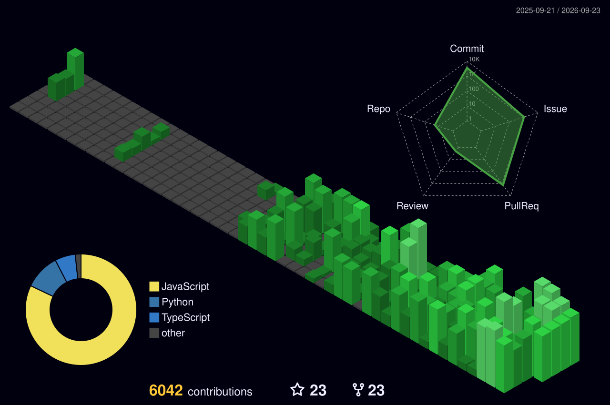

### Hi there, I'm Jason Vaughan 👋

**Systems Builder | Infrastructure Lead | AI Tooling Developer**

I build robust production tools, high-performance routing backends, and agentic AI frameworks that replace manual operational toil with scalable automation. For the last 25 years, I've managed the technical execution, zero-fail network topology, and fiber-optic infrastructure for some of the world's largest flagship broadcasts (Google I/O, AWS re:Invent, Salesforce Dreamforce). 

🌐 **[View my Developer Portfolio](https://jasonvaughan.com/?pass=github)**

---

### ⚡ Recent Activity
<!--START_SECTION:activity-->
1. ℹ️ Labeled PR [#1834](https://github.com/Jason-Vaughan/TangleClaw/pull/1834) in [Jason-Vaughan/TangleClaw](https://github.com/Jason-Vaughan/TangleClaw)
2. ℹ️ Labeled PR [#1834](https://github.com/Jason-Vaughan/TangleClaw/pull/1834) in [Jason-Vaughan/TangleClaw](https://github.com/Jason-Vaughan/TangleClaw)
3. 💪 Opened PR [#1834](https://github.com/Jason-Vaughan/TangleClaw/pull/1834) in [Jason-Vaughan/TangleClaw](https://github.com/Jason-Vaughan/TangleClaw)
4. 🎉 Merged PR [#1833](https://github.com/Jason-Vaughan/TangleClaw/pull/1833) in [Jason-Vaughan/TangleClaw](https://github.com/Jason-Vaughan/TangleClaw)
5. 💪 Opened PR [#1833](https://github.com/Jason-Vaughan/TangleClaw/pull/1833) in [Jason-Vaughan/TangleClaw](https://github.com/Jason-Vaughan/TangleClaw)
<!--END_SECTION:activity-->

---

### 🏗️ Contribution Architecture

---

### 🛠️ Core Systems & Projects
*   **[TangleClaw](https://jasonvaughan.com/?pass=github#tangleclaw):** An open-source, local-first AI-native SDLC orchestration platform.
*   **[TangleBrain](https://jasonvaughan.com/?pass=github#tanglebrain):** A local LLM router and gateway that manages concurrent local/cloud inference backends.
*   **[TiLT](https://tilt16.com):** A production time-tracking PWA that automates complex payroll calculations for event workforces.
*   **[ClawBridge](https://jasonvaughan.com/?pass=github#clawhub):** An HTTP-to-IPC daemon exposing local agent instances as supervised background build services.
